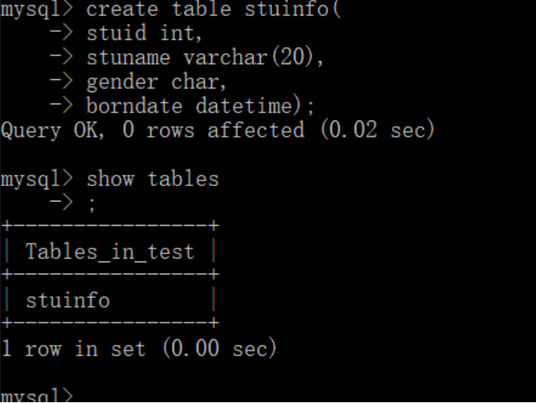
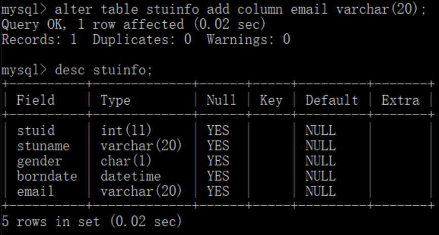
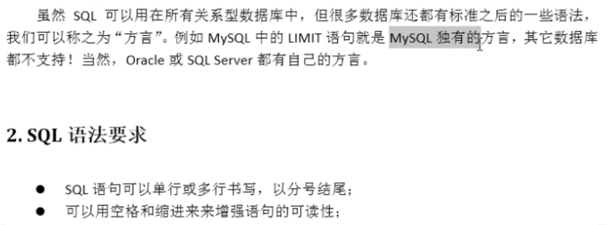
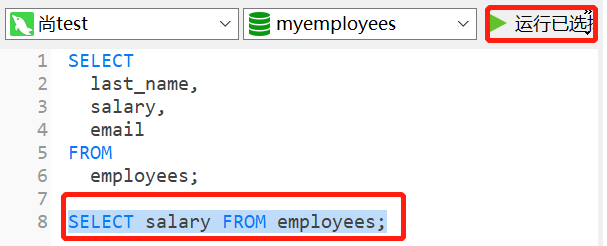

# 1. 数据库概述

## 1. 什么是数据库

## 2. SQL加载执行顺序

```sql
From <left_table>
on <join_condition>
<join_type> join <right_table>
where <where_condition>
group by <group_by_list>
Having <having_condition>
select
distinct <select_list>
order by <order_by_condition>
Limit <number>

```


# 2. 常见SQL命令

## 1. 连接

1. root连接：`mysql -uroot -p`
2. 其他服务器连接：` mysql -h(ip) -P(端口号) -u -p`
   - 第一个p大写
   - -h, -P, -u和后面的输入，加不加空格都行
   - 最后的-p和密码不能加空格

## 2. 命令结尾

1. 以分号或`\g`结尾

## 3. 查看数据库/表

1. 查看当前数据库：`show databases;`

2. 查看某个表

   - 方式1：

     ```mysql
     use test; # test为数据名， use帮我们转到要操作的数据库中
     show tables;
     ```

   - 方式2：

     ```mysql
     show tables from test;
     ```

3. 查看当前在哪个数据库

   - ```mysql
     select database();
     ```

## 4. 建表：

1. 类似于创建一个类，括号里面是属性，mysql中称为字段，字段后跟着它的类型。注：varchar是可变字符(括号中指定字符的最大长度

```mysql
create table stuinfo(字段1 类型， 字段2 类型)；
```



## 5. 查看表的结构

```mysql
desc stuinfo; #describe的缩写
```

## 6. 查询

```mysql
select * from stuinfo;
```

## 7. 插入数据

```mysql
insert info stuinfo values(1, '张无忌', '男','1998-3-3')
```

1. 如果因为中文和编码没成功，可以执行`set names gbk`，然后再插入

## 8. 修改

```mysql
update stuinfo set borndate='1980-1-1' where stuid = 2;
```

​	还是用了where限定

## 9. 删除

```mysql
delete from stuinfo where stuid = 1;
```

## 10. 修改表的结构

```mysql
alter table stuinfo add column email varchar(20);
```



## 11. 删除表

```mysql
drop table stuinfo;
```

## 12. sql注意事项

1. 不区分大小写
   - 库名，表名，字段名，建议大写
   - 其他建议小写

2. 注释：

- - 单行注释，井号#
  - --空格，也是单行
  - 多行/*.....*/，不能嵌套注释



## 13. SQL分类


# 3. 基础查询

## 1. 语法

1. ```mysql
   select 查询列表 from 表明;
   ```

   - 类似于：`System.out.println(打印东西)`

2. 特点

   - 查询列表可以是：
     - 表中的字段、常量值、表达式、函数
   - 查询的结果，是一个虚拟的表格

## 2. 查询表中字段

1. 单个字段

   - ```mysql
     select last_name from employees;
     ```

2. 多个字段

   - ```mysql
     select last_name, salary, email from employees;
     ```

3. 所有字段

   - ```mysql
     select * from employees;
     ```

   - 或者手动加上所有字段


## 3. 查询细节补充

1. 查询前，最好在语句最上面添加`use 库名;`，指定在哪个库查询

2. 对于一些容易和SQl关键字混淆的字段，可以用着重号``来扩上

   - ```mysql
     select `last_name` from employees;
     ```

3. 可以选定要执行的SQL语句去执行




## 4. 查询常量、表达式、函数

```mysql
select 100;
```

